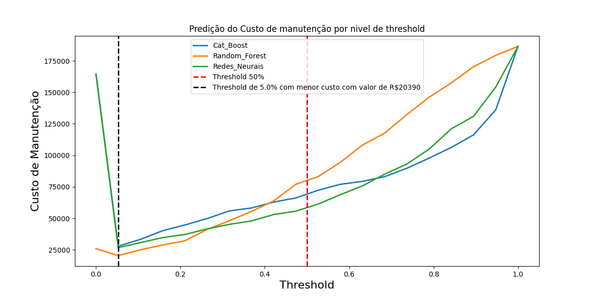
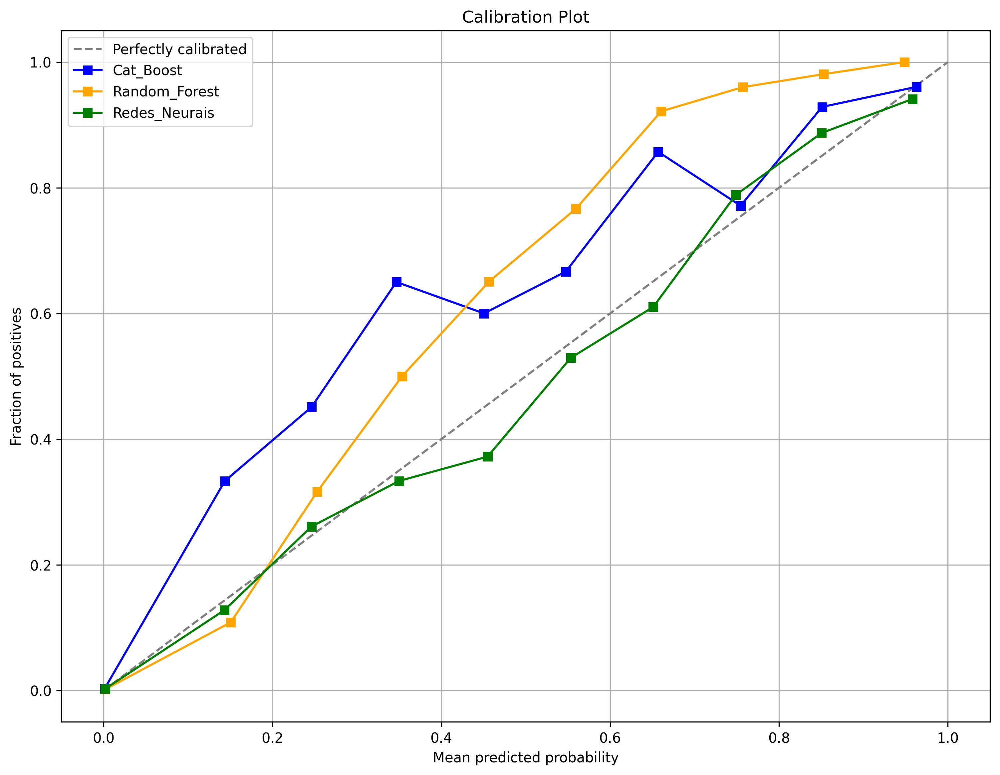

# Desafio-BIX-Tecnologia
Este repositório faz parte do processo seletivo para a vaga na empresa Bix Tecnologia. As respostas para o desafio estão detalhadas neste [README](respostas.md). Os dados estao na pasta "dados" e são dois arquivos CSV: [air_system_previous_years.csv](air_system_previous_years.csv) arquivo contendo todas as informações do setor de manutenção para os anos anteriores a 2022, com 178 colunas e [air_system_present_year.csv](air_system_present_year.csv) arquivo contendo todas as informações do setor de manutenção neste ano.

O repositório contém quatro notebooks, cada um abordando uma etapa específica do projeto:

1. [Análise Exploratória](analise_exploratoria_air_system.ipynb)
2. [Tratamento de Dados](tratamento_dados_air_system.ipynb)
3. [Treinamento de Modelos](treinamento_modelos.ipynb)
4. [Avaliação de Modelos](avaliacao_modelos.ipynb)

## Analise Exploratória

No notebook [Análise Exploratória](analise_exploratoria_air_system.ipynb), importei e examinei os dados. Durante a análise, identifiquei:

- Muitos valores nulos e colunas com zeros.
- Desbalanceamento de classes, com a classe negativa representando 98% dos dados e a classe positiva menos de 2%.
- Padrões e anomalias nos dados.
- Colunas redundantes ou irrelevantes.
- Necessidade de tratamento dos valores ausentes e padronização das variáveis.

Esta etapa inicial foi crucial para orientar as próximas etapas, garantindo a preparação adequada dos dados.

## Tratamento de Dados

No notebook [Tratamento de Dados](tratamento_dados_air_system.ipynb), realizei o seguinte:

- Removi colunas com alta proporção de valores nulos e zeros (acima de 40%).
- Imputei valores ausentes utilizando a mediana.
- Utilizei o algoritmo `RandomOverSampler(sampling_strategy=1)` para lidar com o desbalanceamento de classes.
- Normalizei os dados com `StandardScaler()`.
- Reduzi a dimensionalidade utilizando `VarianceThreshold(threshold=0.3)`, `SmartCorrelatedSelection()` e `RFE()`, resultando em 20 colunas selecionadas.

## Treinamento de Modelos

No notebook [Treinamento de Modelos](treinamento_modelos.ipynb), selecionei e treinei os seguintes modelos:

- **CatBoost**
- **Random Forest**
- **Redes Neurais Sequenciais**

Para otimização dos modelos:

- Utilizei `BayesSearchCV` para CatBoost e Random Forest.
- Utilizei `keras_tuner.RandomSearch` para otimizar os hiperparâmetros das Redes Neurais Sequenciais.

## Avaliação de Modelos

No notebook [Avaliação de Modelos](avaliacao_modelos.ipynb), avaliei o desempenho dos modelos utilizando a métrica de recall:

- **Redes Neurais Sequenciais**: Recall de 73%
- **CatBoost**: Recall de 68%
- **Random Forest**: Recall de 60%

### Análise de Custo Monetário

O desafio nos indicou os custos a seguir:
- Se um caminhão for enviado para manutenção, mas não apresentar defeito nesse sistema, cerca de $10 serão cobrados pelo tempo gasto durante a inspeção pela equipe especializada.
- Se um caminhão for enviado para manutenção e apresentar defeito nesse sistema, $25 serão cobrados para realizar o serviço de reparo preventivo.
- Se um caminhão com defeito no sistema de ar não for enviado diretamente para manutenção, a empresa paga $500 para realizar a manutenção corretiva, considerando a mão de obra, substituição de peças e outros possíveis inconvenientes (por exemplo, o caminhão quebrar no meio do trajeto).

Avaliei o desempenho dos modelos com base nos custos monetários de manutenção para diferentes thresholds:

- **Random Forest**: Menor custo monetário de 21.805 unidades para um threshold de 5%.
- **Redes Neurais Sequenciais**: Custo de 26.735 unidades para o mesmo threshold.
- **CatBoost**: Custo de 46.010 unidades.

### Matriz de Confusão (Threshold de 5%)

- **Random Forest**: Acertos de 357 de 373.
- **Redes Neurais Sequenciais**: Acertos de 345 de 373.
- **CatBoost**: Acertos de 298 de 373.

## Análise de Calibração

**Ao analisar o gráfico de calibração, observei que o modelo de Redes Neurais apresentou o melhor desempenho, mantendo uma consistência superior em todos os níveis.**

